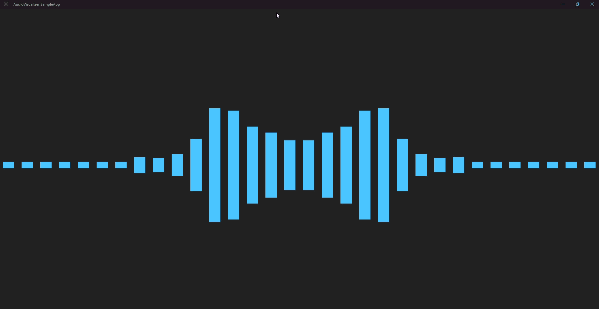

# AudioVisualizer

A modern WinUI 3 audio visualizer control that displays real-time audio visualization using FFT (Fast Fourier Transform) analysis. Perfect for media players, audio applications, and entertainment software on Windows.



## Features

- Real-time WASAPI capture with configurable FFT bands (8 / 16 / 32 / 64, log-spaced ~20 Hz–14 kHz)
- `AudioSourceMode` to capture system output (loopback), microphone input, or both
- `BandCount` to choose how many frequency bands are displayed (default `Sixteen`)
- `VisualizationStyle` layouts: `Mirrored` (default), `BarsBottom`, `BarsTop`, `BarsLeft`, `BarsRight`, and `Circular`
- Customizable colors via WinUI theme resources, with live updates for theme and accent changes
- `Paused` property to pause or resume audio capture and the Win2D animation
- Automatic capture rebind when the default output or input device changes
- Smooth animations using Win2D rendering
- Responsive design that adapts to any container size
- Built for WinUI 3 on Windows 10+ (x86, x64, and ARM64)

## Requirements

- Windows 10.0.17763 or later
- .NET 8.0 or later
- A WinUI 3 host app (Windows App SDK)

## Installation

Nuget: https://www.nuget.org/packages/AudioVisualizer

Install via NuGet Package Manager:

```bash
dotnet add package AudioVisualizer --version 1.2.0
```

Or via Package Manager Console:

```
Install-Package AudioVisualizer -Version 1.2.0
```

**Current stable version: 1.2.0**

## Quick Start

Add the visualizer to your XAML page:

```xml
<Page
    xmlns:local="using:AudioVisualizer"
    ...>
    <Grid>
        <local:AudioVisualizer
            x:Name="Visualizer"
            AudioSourceMode="Output"
            BandCount="Sixteen"
            VisualizationStyle="Mirrored"
            Paused="False"
            VisualizerBackgroundBrush="Transparent"
            VisualizerBarsBrush="{ThemeResource AccentFillColorDefaultBrush}" />
    </Grid>
</Page>
```

With the default `AudioSourceMode="Output"`, the visualizer captures system playback (WASAPI loopback) and displays the real-time visualization.

## Customization

You can customize appearance, capture source, and playback with these properties:

- **AudioSourceMode** - Which audio to analyze: `Output` (default loopback), `Input` (microphone), or `Both` (merge with per-band maximum)
- **BandCount** - Number of frequency bands: `Eight`, `Sixteen` (default), `ThirtyTwo`, or `SixtyFour`
- **VisualizationStyle** - Layout: `Mirrored` (default), `BarsBottom`, `BarsTop`, `BarsLeft`, `BarsRight`, or `Circular`
- **Paused** - When `true`, stops audio capture and pauses the Win2D animation; when `false`, resumes both
- **VisualizerBackgroundBrush** - Background color of the visualization area
- **VisualizerBarsBrush** - Color of the frequency bars (prefer a `SolidColorBrush` or theme resource for live accent/theme updates)

Example:

```xml
<local:AudioVisualizer
    x:Name="Visualizer"
    AudioSourceMode="Both"
    BandCount="ThirtyTwo"
    VisualizationStyle="Circular"
    Paused="False"
    VisualizerBackgroundBrush="Black"
    VisualizerBarsBrush="Cyan" />
```

### Microphone privacy

`Input` and `Both` use the default Windows capture device. The host app must be allowed microphone access under **Settings → Privacy & security → Microphone**. If permission is denied in `Both` mode, the control raises `Error` for the mic failure and keeps visualizing output when loopback still works.

### Error handling

Subscribe to the `Error` event to learn when capture fails in a non-recoverable way (for example, start failure or exhausted device-rebind retries). Teardown failures on a dead audio endpoint are swallowed internally and do not raise this event.

```csharp
Visualizer.Error += (sender, e) =>
{
    // e.Message, e.Exception, e.IsRecoverable
};
```

## Audio device changes

When the default Windows output or input device changes (depending on `AudioSourceMode`), the control restarts capture on the new endpoint automatically. Bars should resume within a few seconds without restarting the app.

## Dependencies

This package targets `net8.0-windows10.0.26100.0` and brings:

- NAudio 2.3.0
- Microsoft.Graphics.Win2D 1.4.0

## License

This project is licensed under the MIT License - see the LICENSE file for details.
